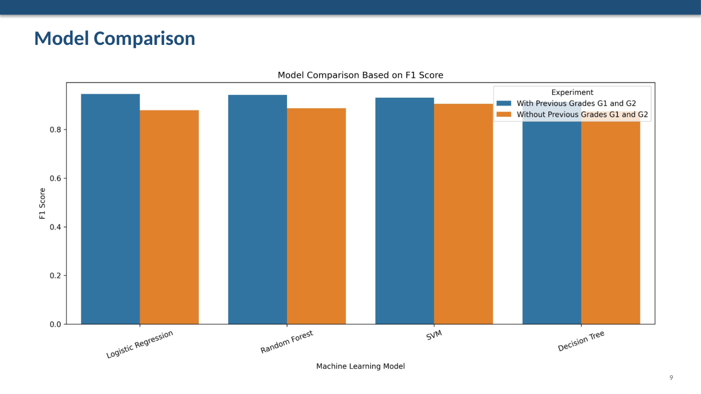

<div align="center">

# 🎓 Student Performance Prediction

### Data Mining & Machine Learning Classification Project

A reproducible machine learning project that predicts whether a student will **Pass or Fail** using the **UCI Student Performance** dataset and compares multiple classification models under two scenarios: **with** and **without** previous grades.


<br>



</div>

---

## 📌 Project Overview

This project applies supervised machine learning to predict whether a student will pass or fail a course.

The target variable is engineered from the final grade:

```text
pass_final = 1  if G3 >= 10
pass_final = 0  if G3 < 10
```

The project evaluates four classification algorithms:

- Logistic Regression
- Decision Tree
- Random Forest
- Support Vector Machine (SVM)

Two experiments are compared:

1. **With previous grades (`G1`, `G2`)**
2. **Without previous grades (`G1`, `G2`)** to simulate an earlier-warning setting before prior grade information is available

---

## 📊 Dataset

**Source:** UCI Student Performance Dataset  
**Course file:** `student-por.csv`

| Item | Value |
|---|---:|
| Student records | 649 |
| Original features | 33 |
| Final project columns | 34 |
| Passed | 549 |
| Failed | 100 |
| Pass rate | ~84.6% |

The features cover demographic, family, school, behavioral, support-related, and academic information.

---

## 🔄 Workflow

```text
UCI Student Performance Data
            │
            ▼
      Data Inspection
            │
            ▼
   Cleaning & Target Creation
            │
            ▼
 Exploratory Data Analysis
            │
            ▼
 Preprocessing Pipeline
 ├─ Numerical: Imputation + Scaling
 └─ Categorical: Imputation + One-Hot Encoding
            │
            ▼
      Train/Test Split
       80% / 20%
            │
            ▼
  Four Classification Models
            │
            ▼
 Accuracy • Precision • Recall
        F1 • ROC-AUC
            │
            ▼
 Model Comparison & Interpretation
```

---

## 🧪 Experiments

### Experiment 1 — With Previous Grades

Uses `G1` and `G2` as predictors.

This scenario answers:

> How accurately can final pass/fail performance be predicted when previous period grades are already available?

### Experiment 2 — Without Previous Grades

Excludes `G1` and `G2`.

This scenario is more relevant to an **early-warning system**, because the model must rely on demographic, behavioral, support, attendance, and other non-grade factors.

---

## 📈 Model Results

### With Previous Grades (`G1`, `G2`)

| Model | Accuracy | Precision | Recall | F1 | ROC-AUC |
|---|---:|---:|---:|---:|---:|
| **Logistic Regression** | **0.9077** | **0.9455** | 0.9455 | **0.9455** | 0.9273 |
| Random Forest | 0.9000 | 0.9292 | 0.9545 | 0.9417 | **0.9309** |
| SVM | 0.8769 | 0.8983 | **0.9636** | 0.9298 | 0.9168 |
| Decision Tree | 0.8538 | 0.9174 | 0.9091 | 0.9132 | 0.7295 |

### Without Previous Grades (`G1`, `G2`)

| Model | Accuracy | Precision | Recall | F1 | ROC-AUC |
|---|---:|---:|---:|---:|---:|
| **SVM** | **0.8308** | 0.8607 | **0.9545** | **0.9052** | **0.6691** |
| Random Forest | 0.8000 | 0.8500 | 0.9273 | 0.8870 | 0.6557 |
| Logistic Regression | 0.7923 | **0.8673** | 0.8909 | 0.8789 | 0.6227 |
| Decision Tree | 0.7846 | 0.8596 | 0.8909 | 0.8750 | 0.5455 |

---

## 🏆 Best Models

### Best Overall Model

**Logistic Regression with `G1` and `G2`**

- Accuracy: **0.9077**
- Precision: **0.9455**
- Recall: **0.9455**
- F1-score: **0.9455**
- ROC-AUC: **0.9273**

### Best Early-Warning Model

**SVM without `G1` and `G2`**

- Accuracy: **0.8308**
- F1-score: **0.9052**
- Recall: **0.9545**

This shows that useful early-warning signals remain available even when previous grades are excluded.

---

## 🔍 Key Findings

- `G1` and `G2` are the strongest predictors of final performance.
- Previous failures are an important negative signal.
- Without prior grades, variables such as **failures, absences, higher-education intention, family relationship quality, weekend alcohol consumption, going out, age, and school** become more influential.
- Because the dataset is imbalanced toward passing students, **F1-score and recall** are more informative than accuracy alone.

---

## 🛠️ Technical Approach

### Preprocessing

- Median imputation for numerical features
- Standard scaling using `StandardScaler`
- Most-frequent imputation for categorical features
- One-hot encoding with unknown-category handling
- `ColumnTransformer` + `Pipeline` for reproducibility

### Train/Test Setup

```text
Test size: 20%
Random state: 42
Stratified split: Yes
```

### Algorithms

```text
Logistic Regression
Decision Tree
Random Forest
SVM (RBF kernel)
```

---

## 📂 Repository Structure

```text
Student-Performance-Prediction/
├── README.md
├── student_performance_prediction.ipynb
├── student_performance_prediction.py
├── requirements.txt
├── cleaned_student_performance.csv
├── model_results.csv
├── model-comparison-preview.png
├── Student_Performance_Data_Mining_Report.pdf
└── Student_Performance_Data_Mining_Presentation.pdf
```

---

## ⚠️ Limitations

- The Pass class is much larger than the Fail class.
- The dataset represents a specific educational context and may not generalize directly to other schools or countries.
- Using `G1` and `G2` improves predictive performance but reduces the value for very early intervention.
- Behavioral and social attributes require careful consideration of privacy, fairness, and ethical use.
- Hyperparameter tuning and cross-validation could further strengthen the evaluation.

---

## 🚀 Future Work

- Cross-validation
- Hyperparameter tuning
- Fairness analysis
- Class-imbalance techniques
- Explainability / feature interpretation
- Deployment as an academic early-warning dashboard

---

## 👤 Author

**Mustafa Abughareebeh**  
Data Science & Artificial Intelligence Undergraduate

[Portfolio](https://mustafa-ai-ds.github.io/mustafaportfolio/) ·
[LinkedIn](https://www.linkedin.com/in/mustafa-abughareebeh/) ·
[Kaggle](https://www.kaggle.com/mustafaabughareebeh) ·
[GitHub](https://github.com/Mustafa-AI-DS)
